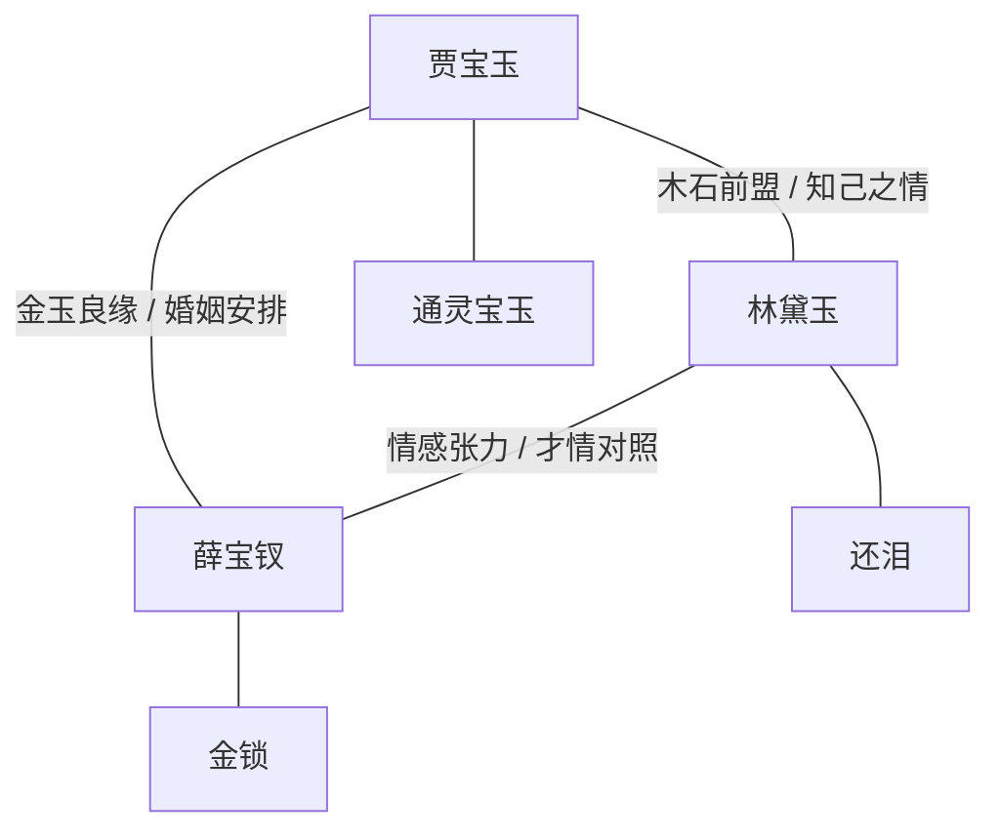
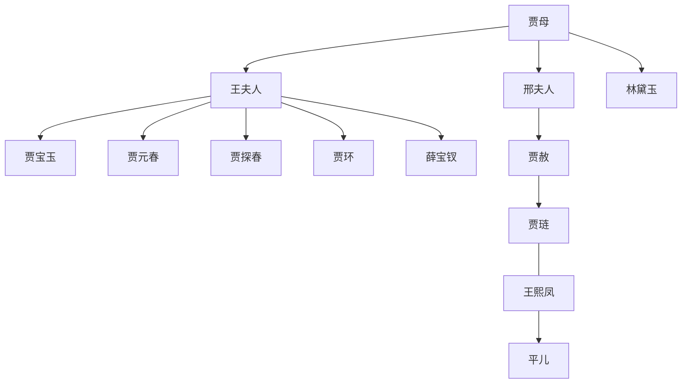
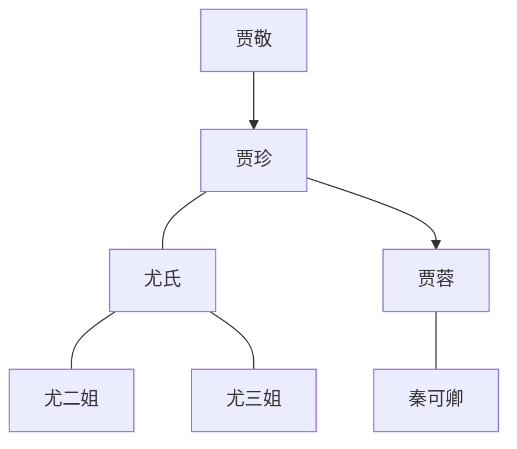
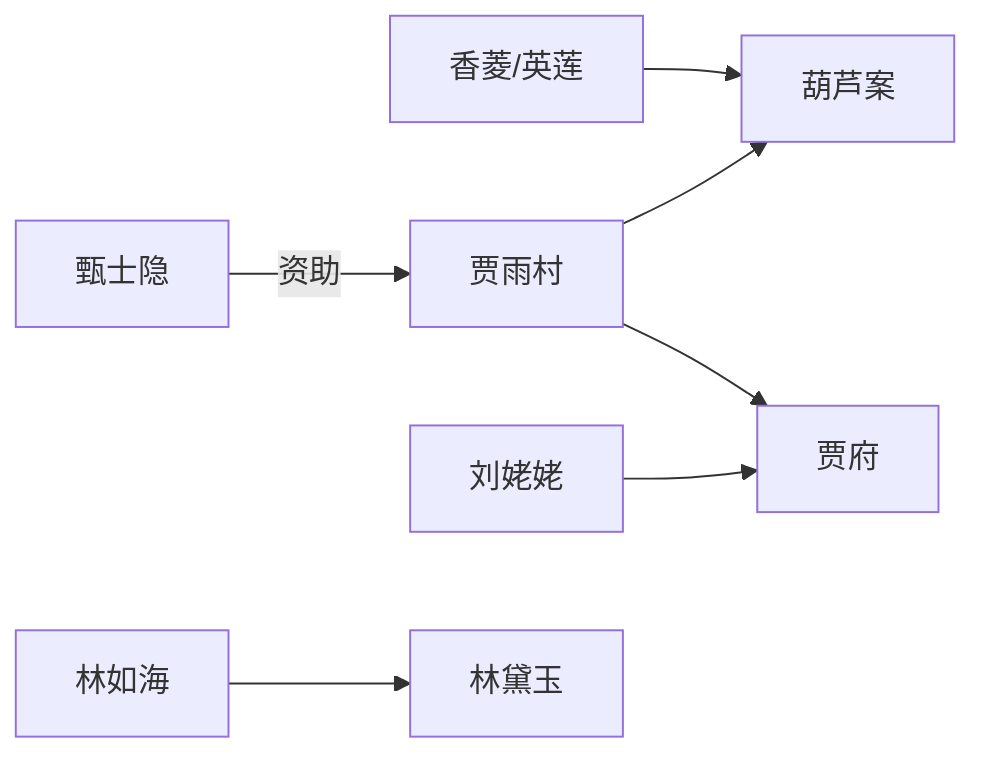

# 人物关系图

## 核心三角

- [[02_Learn/08_book-wikis/红楼梦/characters/贾宝玉.md]] 是情感、审美和叛逆意识的中心。
- [[02_Learn/08_book-wikis/红楼梦/characters/林黛玉.md]] 对应 [[02_Learn/08_book-wikis/红楼梦/concepts/木石前盟.md]]、[[02_Learn/08_book-wikis/红楼梦/concepts/还泪.md]]。
- [[02_Learn/08_book-wikis/红楼梦/characters/薛宝钗.md]] 对应 [[02_Learn/08_book-wikis/红楼梦/concepts/金玉良缘.md]] 和家族婚姻秩序。

## 荣国府内宅权力

- [[02_Learn/08_book-wikis/红楼梦/characters/贾母.md]] 是情感与辈分的最高中心。
- [[02_Learn/08_book-wikis/红楼梦/characters/王夫人.md]] 代表母权、礼法和宝玉婚姻安排。
- [[02_Learn/08_book-wikis/红楼梦/characters/王熙凤.md]] 是荣府日常治理的执行中枢。
- [[02_Learn/08_book-wikis/红楼梦/characters/平儿.md]] 是王熙凤权力运作中的缓冲和调和者。

## 宁国府线

- [[02_Learn/08_book-wikis/红楼梦/characters/秦可卿.md]] 是宁府危机和第五回梦境结构之间的关键连接点。
- [[02_Learn/08_book-wikis/红楼梦/characters/贾珍.md]]、[[02_Learn/08_book-wikis/红楼梦/characters/贾蓉.md]] 承载宁府礼法崩坏线。
- [[02_Learn/08_book-wikis/红楼梦/characters/尤二姐.md]]、[[02_Learn/08_book-wikis/红楼梦/characters/尤三姐.md]] 推动后半部情欲、婚姻与女性悲剧线。

## 外部观察者与官场线

- [[02_Learn/08_book-wikis/红楼梦/characters/贾雨村.md]] 是官场、司法和贾府权势之间的连接人物。
- [[02_Learn/08_book-wikis/红楼梦/characters/刘姥姥.md]] 是外部贫寒世界观察贾府盛衰的视角。
- [[02_Learn/08_book-wikis/红楼梦/characters/香菱.md]] 从英莲被拐到薛家妾室，贯穿薄命女性线。

## 相关页面

- [[02_Learn/08_book-wikis/红楼梦/queries/人物索引.md]]
- [[02_Learn/08_book-wikis/红楼梦/outputs/红楼梦人物手册.md]]
- [[02_Learn/08_book-wikis/红楼梦/timelines/宝黛钗关系时间线.md]]
