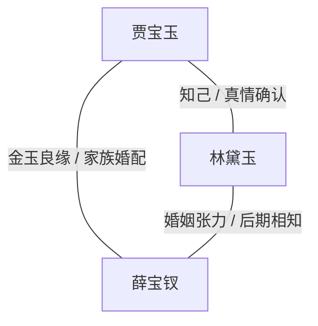
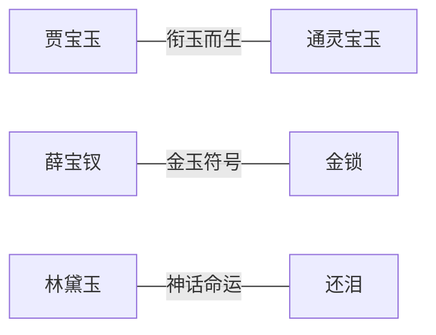
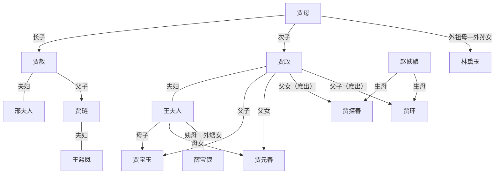
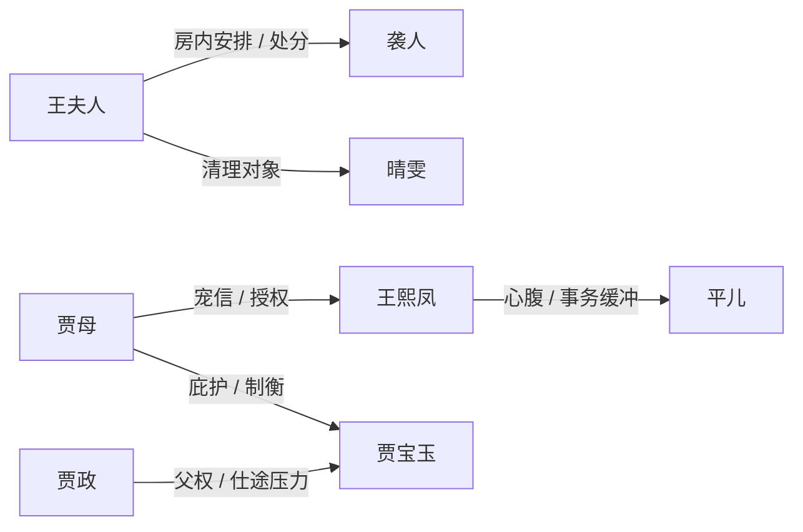
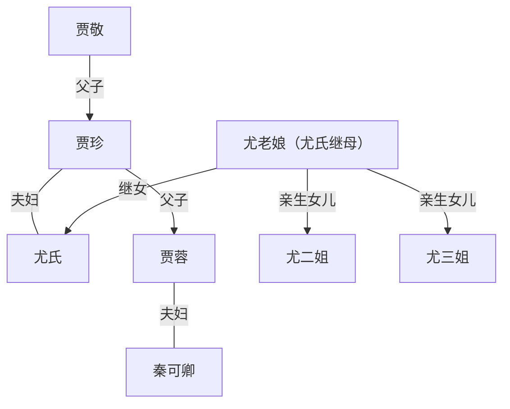
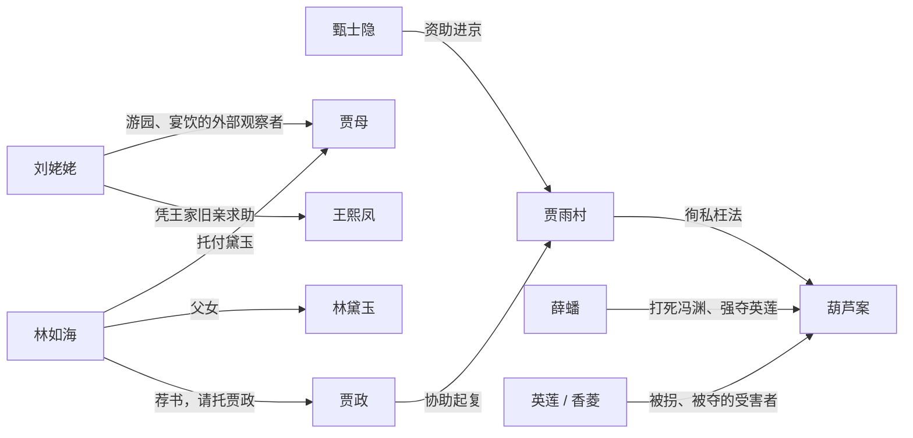

# 人物关系图

这不是把所有人物塞进一张网的“全人物图”，而是五组可核查的关系图。每条边都写明关系性质；图下批注再说明这段关系的叙事作用和可回读事件。

## 图例与核查原则

- **箭头**表示血缘、托付、资源流向或权力作用，标签写明方向的含义。
- **实线双向关系**表示夫妇、知己、亲属或协作，不表示谁支配谁。
- 图中只把正文可确证的血缘、婚姻和行动关系画成事实边；涉及秦可卿与贾珍的伦理疑云，只在批注中保留“待辨”说明，不画成既成事实。
- 事件链接都带有原文锚点入口；读图时应先看“是什么关系”，再看“哪件事让它显形”。

## 一、宝黛钗：真情、婚姻与女性处境

```mermaid
graph TD
  BY[贾宝玉] ---|知己 / 真情确认| LDY[林黛玉]
  BY ---|金玉良缘 / 家族婚配| XBC[薛宝钗]
  LDY ---|婚姻张力 / 后期相知| XBC
```

### 关系批注

- **贾宝玉—林黛玉**：不是泛泛的“青梅竹马”，而是以共同文学经验、试探和“你放心”的心意确认形成的知己关系。先读[[02_Learn/08_book-wikis/红楼梦/events/宝黛共读西厢.md|宝黛共读西厢]]，再读[[02_Learn/08_book-wikis/红楼梦/events/宝黛诉肺腑.md|宝黛诉肺腑]]。
- **贾宝玉—薛宝钗**：两人关系从通灵玉与金锁的符号相照开始，随后被母辈、薛家与贾府的婚姻期待塑形；它不是宝玉单独选择的恋爱线。入口是[[02_Learn/08_book-wikis/红楼梦/events/宝钗看玉.md|宝钗看玉]]与[[02_Learn/08_book-wikis/红楼梦/events/掉包计.md|掉包计]]。
- **林黛玉—薛宝钗**：两人确有婚姻处境带来的张力，却不能简化为互相敌对；宝钗探病、金兰语等情节也写出理解和怜惜。可从[[02_Learn/08_book-wikis/红楼梦/events/黛玉风雨词.md|黛玉风雨词]]进入。

### 命运象征（不是人际关系）

```mermaid
graph LR
  BY[贾宝玉] ---|衔玉而生| TLBY[通灵宝玉]
  XBC[薛宝钗] ---|金玉符号| JS[金锁]
  LDY[林黛玉] ---|神话命运| HL[还泪]
```

通灵玉、金锁和还泪是人物命运的象征线索，不应与父女、夫妇等现实关系混读。分别参见[[02_Learn/08_book-wikis/红楼梦/concepts/木石前盟.md|木石前盟]]、[[02_Learn/08_book-wikis/红楼梦/concepts/金玉良缘.md|金玉良缘]]、[[02_Learn/08_book-wikis/红楼梦/concepts/还泪.md|还泪]]。

## 二、荣国府：血缘、婚姻与嫡庶

```mermaid
graph TD
  JM[贾母]
  JS[贾赦]
  JZ[贾政]
  XF[邢夫人]
  WF[王夫人]
  ZY[赵姨娘]
  JL[贾琏]
  WXF[王熙凤]
  BY[贾宝玉]
  YC[贾元春]
  TC[贾探春]
  JH[贾环]
  LDY[林黛玉]
  XBC[薛宝钗]
  JM -->|长子| JS
  JM -->|次子| JZ
  JS ---|夫妇| XF
  JZ ---|夫妇| WF
  JS -->|父子| JL
  JL ---|夫妇| WXF
  JZ -->|父子| BY
  WF -->|母子| BY
  JZ -->|父女| YC
  WF -->|母女| YC
  JZ -->|父女（庶出）| TC
  ZY -->|生母| TC
  JZ -->|父子（庶出）| JH
  ZY -->|生母| JH
  JM -->|外祖母—外孙女| LDY
  WF ---|姨母—外甥女| XBC
```

### 关系批注

- **贾母—贾赦—贾政**：贾母是贾赦、贾政之母；邢夫人、王夫人分别是两房媳妇，不是贾母的女儿。第003回黛玉入府时的称呼、座次和拜见顺序，是读这张家族图最可靠的现场：[[02_Learn/08_book-wikis/红楼梦/events/黛玉进贾府.md|黛玉进贾府]]。
- **贾政—王夫人—宝玉/元春**：宝玉、元春都是贾政与王夫人的子女；宝玉挨打把贾政的父权、王夫人的母权和贾母的制衡同时推到台前：[[02_Learn/08_book-wikis/红楼梦/events/宝玉挨打.md|宝玉挨打]]。
- **赵姨娘—探春/贾环**：探春、贾环是贾政的庶出子女，赵姨娘是二人的生母；王夫人是他们的嫡母和内宅权力中心，不是生母。探春与赵姨娘的冲突可读[[02_Learn/08_book-wikis/红楼梦/events/赵姨娘辱亲女争闲气.md|赵姨娘辱亲女争闲气]]。
- **贾赦—邢夫人—贾琏**：贾琏是贾赦之子，邢夫人为长房主母；贾赦强纳鸳鸯时，邢夫人成为其欲望的执行者，见[[02_Learn/08_book-wikis/红楼梦/events/鸳鸯拒婚.md|鸳鸯拒婚]]。
- **贾琏—王熙凤—平儿**：贾琏与凤姐为夫妇，平儿是凤姐的心腹、贾琏夫妻冲突中的夹层人物；她既执行凤姐的事务，也常替他人留下余地。可读[[02_Learn/08_book-wikis/红楼梦/events/平儿理妆.md|平儿理妆]]。
- **王夫人—薛宝钗**：王夫人与薛姨妈是姊妹，因此王夫人是宝钗的姨母；这层亲缘让宝钗的寄居与婚姻期待带有现实的王家支持，而不只是“金玉”传说。

## 三、荣国府：谁在行使权力

```mermaid
graph LR
  JM[贾母] -->|宠信 / 授权| WXF[王熙凤]
  WF[王夫人] -->|房内安排 / 处分| XR[袭人]
  WF -->|清理对象| QW[晴雯]
  WXF -->|心腹 / 事务缓冲| PE[平儿]
  JZ[贾政] -->|父权 / 仕途压力| BY[贾宝玉]
  JM -->|庇护 / 制衡| BY
```

### 关系批注

- **贾母—凤姐—平儿**：凤姐的管家权需要贾母的信任，平儿则使这套强势治理不至于处处以凤姐本人出面。凤姐协理宁府是能力高光，也显示这种秩序依赖个人强撑：[[02_Learn/08_book-wikis/红楼梦/events/王熙凤协理宁国府.md|王熙凤协理宁国府]]。
- **王夫人—袭人/晴雯**：王夫人把袭人视作能规束宝玉的可靠人，却把晴雯视为必须清除的风险；同一套“保护宝玉”的逻辑，给两位丫鬟带来相反命运。对读[[02_Learn/08_book-wikis/红楼梦/events/袭人花解语.md|袭人花解语]]与[[02_Learn/08_book-wikis/红楼梦/events/晴雯之死.md|晴雯之死]]。
- **贾政—贾母—宝玉**：贾政希望把宝玉纳入仕途伦理，贾母能在关键时刻阻止暴力升级；这种制衡保护宝玉，却并没有消除他与家族价值的根本冲突。

## 四、宁国府：宗族、婚姻与伦理危机

```mermaid
graph TD
  JJ[贾敬]
  JZH[贾珍]
  YS[尤氏]
  JR[贾蓉]
  QKQ[秦可卿]
  YLM[尤老娘（尤氏继母）]
  YEJ[尤二姐]
  YSJ[尤三姐]
  JJ -->|父子| JZH
  JZH ---|夫妇| YS
  JZH -->|父子| JR
  JR ---|夫妇| QKQ
  YLM -->|继女| YS
  YLM -->|亲生女儿| YEJ
  YLM -->|亲生女儿| YSJ
```

### 关系批注

- **贾敬—贾珍—贾蓉**：宁府的父子承继关系完整，但贾敬出家、贾珍失范、贾蓉软弱，使“宗族继承”只剩名义。可由[[02_Learn/08_book-wikis/红楼梦/events/焦大醉骂.md|焦大醉骂]]观察旧仆如何先说破宁府败相。
- **贾珍—尤氏—贾蓉**：尤氏是贾珍之妻、贾蓉之继母；她名为主母，却无法制衡贾珍。秦可卿丧事中凤姐代为整顿，正显示尤氏的权力限度：[[02_Learn/08_book-wikis/红楼梦/events/王熙凤协理宁国府.md|王熙凤协理宁国府]]。
- **贾蓉—秦可卿**：二人为夫妇；秦可卿病死和丧礼让这段婚姻的空洞、宁府的排场与败亡预感同时显形：[[02_Learn/08_book-wikis/红楼梦/events/秦可卿之死.md|秦可卿之死]]。
- **尤氏—尤二姐/尤三姐**：原文写尤氏把继母接到宁府，继母带来两个亲生女儿；因此二、三姐是尤氏继母带来的名义姐妹，不应误画成“异母姐妹”。后续贾琏私娶尤二姐、凤姐大闹宁府，令这层姻亲网络变成权力危机：[[02_Learn/08_book-wikis/红楼梦/events/凤姐闹宁国府.md|凤姐闹宁国府]]。
- **贾珍—秦可卿（不画事实边）**：正文并未把两人关系明确写成可确证的事实；脂批与红学研究提出伦理疑云，应在[[02_Learn/08_book-wikis/红楼梦/redology/秦可卿之死与宁府败相研究综述.md|秦可卿之死与宁府败相研究综述]]中分层阅读，而非在图中画成既定关系。

## 五、外部视角、官场与案件

```mermaid
graph LR
  ZSY[甄士隐] -->|资助进京| JYC[贾雨村]
  LRH[林如海] -->|荐书，请托贾政| JZ[贾政]
  JZ -->|协助起复| JYC
  JYC -->|徇私枉法| HLA[葫芦案]
  XP[薛蟠] -->|打死冯渊、强夺英莲| HLA
  XL[英莲 / 香菱] -->|被拐、被夺的受害者| HLA
  LLL[刘姥姥] -->|凭王家旧亲求助| WXF[王熙凤]
  LLL -->|游园、宴饮的外部观察者| JM[贾母]
  LRH -->|父女| LDY[林黛玉]
  LRH -->|托付黛玉| JM
```

### 关系批注

- **甄士隐—贾雨村**：甄士隐资助贫寒雨村进京；雨村后来进入官场，这段恩义形成“受恩文人—权力代理人”的反讽对照。入口是[[02_Learn/08_book-wikis/红楼梦/events/贾雨村受资进京.md|贾雨村受资进京]]。
- **林如海—贾政—贾雨村**：林如海写荐书，请贾政协助雨村起复；这不是“雨村天然属于贾府”，而是一条由恩义转化为仕途资源的关系链。见[[02_Learn/08_book-wikis/红楼梦/events/贾雨村起复.md|贾雨村起复]]。
- **英莲/香菱—薛蟠—贾雨村**：英莲先被拐，后被薛蟠强夺；雨村面对冯渊之死与护官符时徇私枉法。葫芦案把个人悲剧、豪门特权和司法失守连在一起：[[02_Learn/08_book-wikis/红楼梦/events/葫芦案.md|葫芦案]]。
- **刘姥姥—凤姐—贾母**：刘姥姥凭王家旧亲向凤姐求助，后又在贾母主持的游园、宴饮中成为外部观察者；她不是“贾府成员”，而是照见贾府盛衰的民间视角。可从[[02_Learn/08_book-wikis/红楼梦/events/刘姥姥一进荣国府.md|刘姥姥一进荣国府]]、[[02_Learn/08_book-wikis/红楼梦/events/刘姥姥二进荣国府.md|刘姥姥二进荣国府]]进入。
- **林如海—林黛玉—贾母**：林如海是黛玉之父；在贾敏去世后，他把女儿托付给岳母贾母，才形成黛玉的寄居命运。入口是[[02_Learn/08_book-wikis/红楼梦/events/黛玉进贾府.md|黛玉进贾府]]。

## 核查依据

- 亲属主干以[[02_Learn/08_book-wikis/红楼梦/texts/simplified/第002回.md#^hlm-002-lengzixing-yanshuo|第002回：冷子兴演说荣国府]]和[[02_Learn/08_book-wikis/红楼梦/texts/simplified/第003回.md#^hlm-003-daiyu-jin-jiafu|第003回：黛玉进贾府]]为准。
- 宁国府中尤氏、继母和二尤的关系，以第063回“继母带来两个女儿”的叙述为准；不把称谓上的“姐妹”擅自改写为血缘。
- 对存在版本与脂批争议的关系，图中只写可确证事实，争议转交红学专题页。

## 相关页面

- [[02_Learn/08_book-wikis/红楼梦/outputs/人物关系阅读指南.md|人物关系阅读指南]]
- [[02_Learn/08_book-wikis/红楼梦/queries/人物索引.md|人物索引]]
- [[02_Learn/08_book-wikis/红楼梦/outputs/红楼梦人物手册.md|红楼梦人物手册]]
- [[02_Learn/08_book-wikis/红楼梦/timelines/宝黛钗关系时间线.md|宝黛钗关系时间线]]
