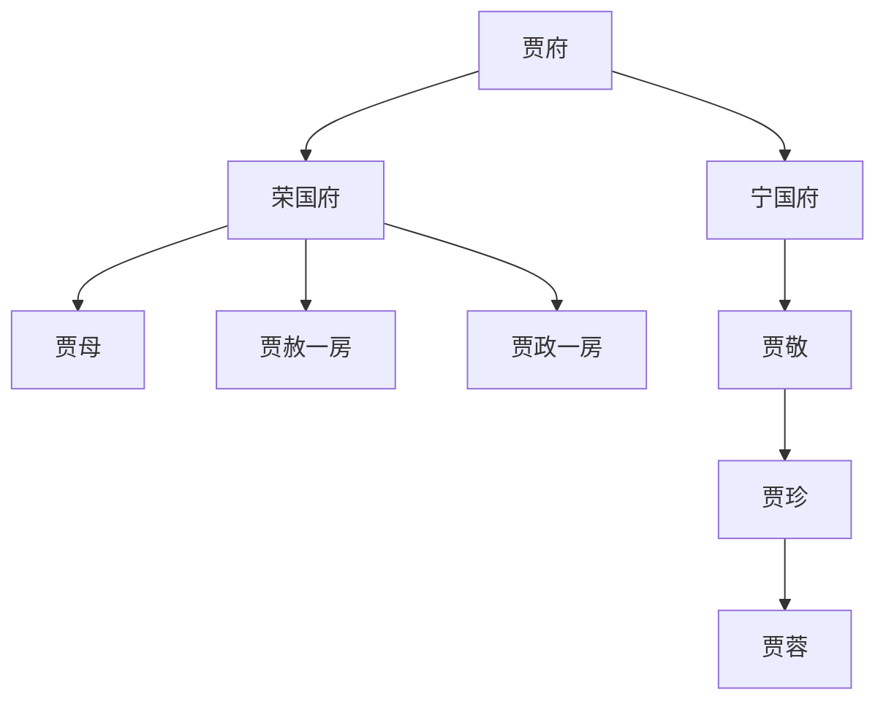
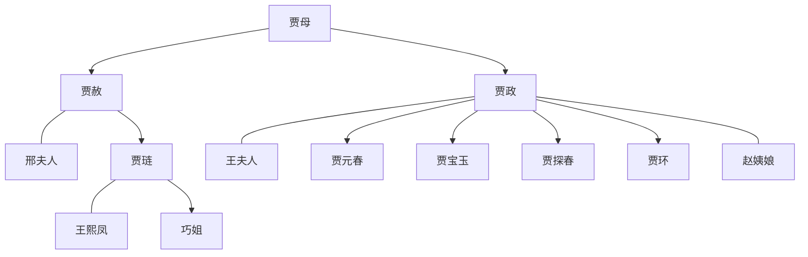
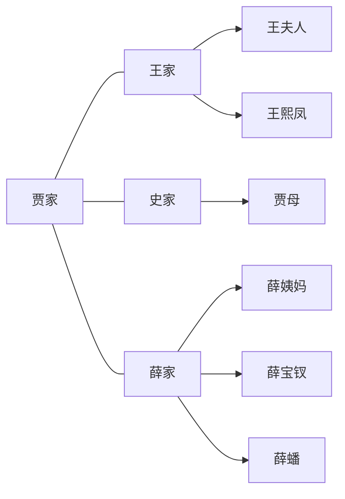

# 贾府结构图

## 两府结构

- [[02_Learn/08_book-wikis/红楼梦/locations/荣国府.md]] 是宝玉、黛玉、宝钗、凤姐等主要生活空间。
- [[02_Learn/08_book-wikis/红楼梦/locations/宁国府.md]] 以秦可卿之死、贾珍贾蓉线和家族礼法崩坏为重点。

## 荣国府：长房与二房

阅读要点：

- 贾赦一房有宗法上的长房位置，但日常叙事重心多在贾政一房和贾母处。
- 贾政代表父权和仕途伦理，宝玉与他的冲突是全书重要结构。
- 王熙凤虽属贾琏之妻，却实际参与荣府内务治理。

## 四大家族关系

- [[02_Learn/08_book-wikis/红楼梦/concepts/护官符.md]] 概括了四大家族互相庇护的权力网络。
- 薛家入京并住进贾府，使 [[02_Learn/08_book-wikis/红楼梦/concepts/金玉良缘.md]] 进入日常生活。

## 相关页面

- [[02_Learn/08_book-wikis/红楼梦/families/贾家.md]]
- [[02_Learn/08_book-wikis/红楼梦/families/王家.md]]
- [[02_Learn/08_book-wikis/红楼梦/families/史家.md]]
- [[02_Learn/08_book-wikis/红楼梦/families/薛家.md]]
- [[02_Learn/08_book-wikis/红楼梦/timelines/贾府兴衰时间线.md]]
